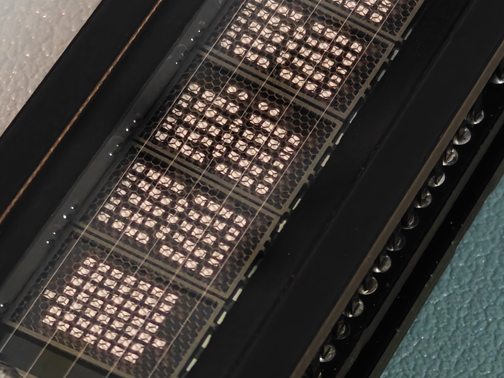
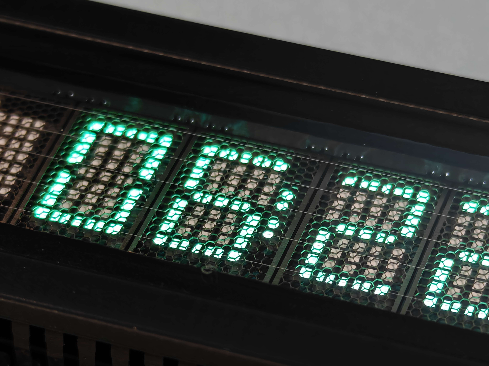
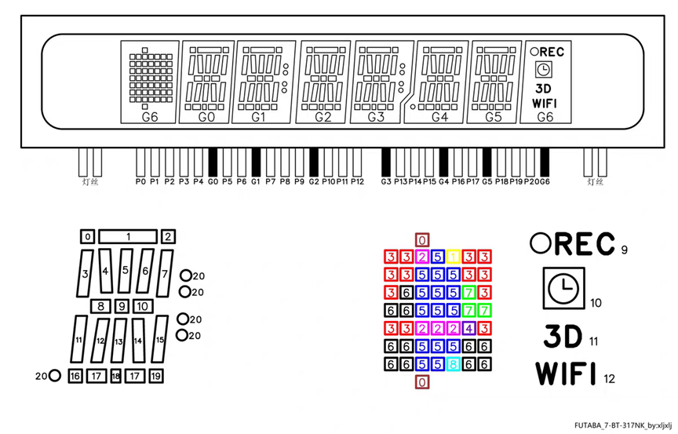

# The-Cyberpunk-Aesthetic-of-VFD
My store, www.makerstore.fun, offers finished products for sale.

The fluorescent glow emitted by VFD displays possesses such a distinct cyber-futuristic vibe. As you can see, this type of display differs significantly from the common LED screens we encounter daily, and its operating principle is equally fascinating.

You can conceptualize it as a miniaturized Cathode Ray Tube (CRT), with its core mechanism relying on thermionic emission to excite phosphors. If you observe closely, you will notice several extremely fine tungsten filaments at the very top. These filaments are coated with oxides of barium, strontium, and calcium.

When heated to 600–650°C, the thermal energy allows electrons on the cathode surface to gain sufficient energy, forming an "electron cloud" around the filaments. To prevent oxidation of the tungsten, the interior of the VFD is maintained in a high-vacuum state.

Situated beneath the filaments is a mesh-like grid, which functions effectively as a switch. When a positive voltage is applied, it attracts and accelerates the electrons emitted by the filaments, allowing them to pass through; conversely, a negative voltage repels them.

Beneath each phosphor segment lies a tiny anode. When a positive voltage is applied here, electrons surge through the grid "switch" and violently bombard the phosphor on the anode. Upon absorbing this energy, the phosphors release their captivating colors, exuding a unique charm of retro-futurism.
#Note! This screen emits a slight sound during operation. This is due to the AC filament scheme used to ensure uniform and vibrant display; the noise comes from filament oscillation.

You can adjust the PWM frequency in the code to find the most suitable and quietest setting for your environment. Caution: Do not set the PWM frequency too high, or it will burn out the filament; too low, and the display will appear dim.
This screen uses an ESP-07S microcontroller, and the Arduino IDE is recommended for the development environment. The board reserves two push-button switches and one LED (active low) for your own development.
You can directly flash the test code and develop custom programs based on it. A ready-made clock program is also provided. Before using the clock code that connects to Wi-Fi, you need to import the WiFiManager library to ensure it compiles and flashes correctly.



The screen has a total of 21 segments. The mapping table in the code translates to binary to define the segment order.
Example:
1: {0x84, 0x80, 0x08}
0x84 = 10000100 0x80 = 10000000 0x08 = 00001000
in this binary representation, 1 represents ON and 0 represents OFF. The segment mapping follows the bit order below (Horizontal segments are mapped to 0):


7 ← 0    15 ← 8   20 ← 16


Note: The three bits following bit 20 are unused. Horizontal segments are mapped to 0.

```cpp
  Table 1 Mapping
  {0x8a,0x88,0x06}, // 0
  {0x84,0x80,0x08}, // 1
  {0x82,0x0f,0x06}, // 2
  {0x82,0x87,0x06}, // 3
  {0x8d,0x87,0x08}, // 4
  {0x0a,0x87,0x06}, // 5
  {0x0a,0x8f,0x06}, // 6
  {0x82,0x80,0x08}, // 7
  {0x8a,0x8f,0x06}, // 8
  {0x8a,0x87,0x06}, // 9
  {0x8a,0x8f,0x09}, // A 10
  {0x8b,0x8f,0x07}, // B 11
  {0x0e,0x08,0x0e}, // C 12
  {0x8f,0x88,0x07}, // D 13
  {0x0f,0x0f,0x0f}, // E 14
  {0x0f,0x0f,0x01}, // F 15
  {0x0e,0x8c,0x06}, // G 16
  {0x8d,0x8f,0x09}, // H 17
  {0x22,0x22,0x06}, // I 18
  {0x84,0x88,0x0f}, // J 19
  {0x4d,0x4B,0x09}, // K 20
  {0x09,0x08,0x0f}, // L 21
  {0xdd,0x8a,0x09}, // M 22
  {0x9d,0xca,0x09}, // N 23
  {0x8f,0x88,0x0f}, // O 24
  {0x8b,0x0f,0x01}, // P 25
  {0x8a,0xc8,0x06}, // Q 26
  {0x8b,0x4f,0x09}, // R 27
  {0x0e,0x87,0x07}, // S 28
  {0x27,0x22,0x24}, // T 29
  {0x8d,0x88,0x8f}, // U 30
  {0x95,0xc2,0x08}, // V 31
  {0x8d,0xda,0x09}, // W 32
  {0x55,0x52,0x09}, // X 33
  {0x55,0x22,0x04}, // Y 34
  {0x47,0x12,0x0f}, // Z 35
  {0xff,0xff,0xff}, // All ON 36
  {0x00,0x00,0x00}  // Clear 37

  Table 2 Mapping (Currently used in code)
  {0x8f,0x88,0x0f}, // 0
  {0x84,0x80,0x08}, // 1
  {0x87,0x0f,0x0f}, // 2
  {0x87,0x87,0x0f}, // 3
  {0x8d,0x87,0x08}, // 4
  {0x0f,0x87,0x0f}, // 5
  {0x0f,0x8f,0x0f}, // 6
  {0x87,0x80,0x08}, // 7
  {0x8f,0x8f,0x0f}, // 8
  {0x8f,0x87,0x0f}, // 9
  {0x8a,0x8f,0x09}, // A 10
  {0x8b,0x8f,0x07}, // B 11
  {0x0e,0x08,0x0e}, // C 12
  {0x8f,0x88,0x07}, // D 13
  {0x0f,0x0f,0x0f}, // E 14
  {0x0f,0x0f,0x01}, // F 15
  {0x0e,0x8c,0x06}, // G 16
  {0x8d,0x8f,0x09}, // H 17
  {0x22,0x22,0x06}, // I 18
  {0x84,0x88,0x0f}, // J 19
  {0x4d,0x4B,0x09}, // K 20
  {0x09,0x08,0x0f}, // L 21
  {0xdd,0x8a,0x09}, // M 22
  {0x9d,0xca,0x09}, // N 23
  {0x8a,0x88,0x06}, // O 24
  {0x8b,0x0f,0x01}, // P 25
  {0x8a,0xc8,0x06}, // Q 26
  {0x8b,0x4f,0x09}, // R 27
  {0x0e,0x87,0x07}, // S 28
  {0x27,0x22,0x24}, // T 29
  {0x8d,0x88,0x8f}, // U 30
  {0x95,0xc2,0x08}, // V 31
  {0x8d,0xda,0x09}, // W 32
  {0x55,0x52,0x09}, // X 33
  {0x55,0x22,0x04}, // Y 34
  {0x47,0x12,0x0f}, // Z 35
  {0xff,0xff,0xff}, // All ON 36
  {0x00,0x00,0x00}  // Clear 37
```
If you're still confused, just share the code and images with an AI—it can help you achieve exactly what you want.
The repository contains the schematics and Arduino example code. Feel free to modify them to achieve your desired effect.

        
